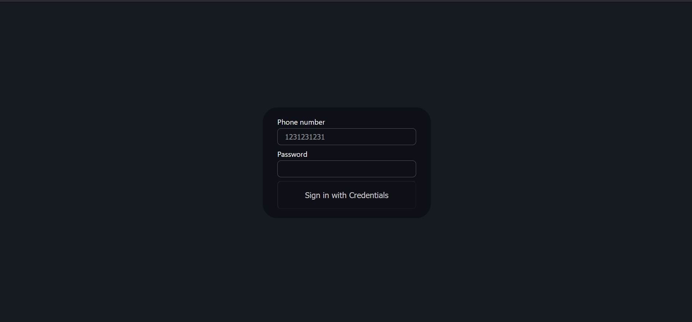
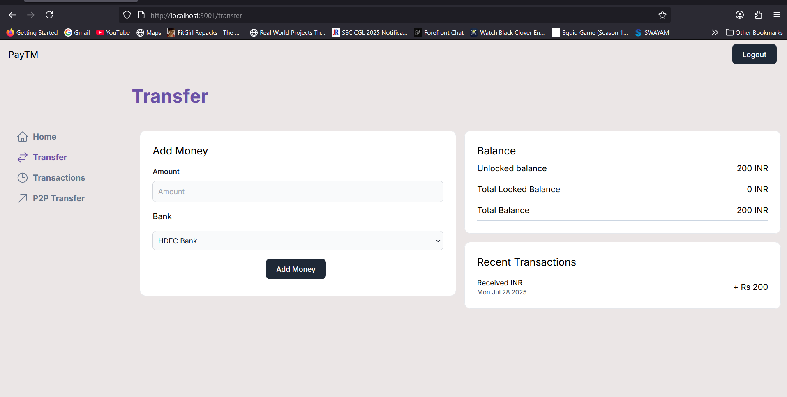
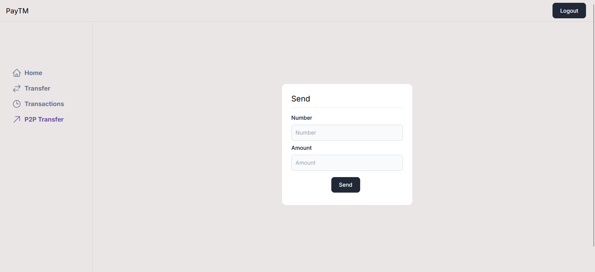

# 💸 Paytm-Style Payment Dashboard

A full-stack Payora inspired by Paytm’s backend design. This project allows seamless tracking of transactions, user roles, and admin functionalities using a modern tech stack.

---

## 🚀 Tech Stack

### Backend
- **Node.js**
- **NestJS**
- **PostgreSQL** (Docker or Local)
- **Prisma ORM**
- **Swagger** for API docs

### Frontend
- **React.js**
- **Next.js (optional)**
- **TailwindCSS**

---

## 📷 Screenshots

### 🔐 Login Page

### 💸 Transfer Page

### 🔄 P2P Transfer Page

---

